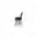
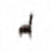
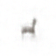
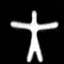

## Implementation of "Variational Inference for Longitudinal Data Using Normalising Flows"


<p align="center">
    <a>
	    
	</a>
    <a>
	    
	</a>
    <a>
	    
	</a>
    <a>
	    
	</a>
    <a>
	    
	</a>
    <a>
	    
	</a>
     <a>
	    
	</a>
    <a>
	    
	</a>
    <a>
	    
    </a>
     <a>
	    
	</a>
    <a>
	    
	</a>
    <a>
	    
    </a>
</p>
<p align="center">
  <b>Generated sequences</b>
</p>

**Disclaimer**: 
- The code in `lib` is an adaptation from [1]. In particular, we adapted their implementation of the IAF flows, the VAE and VAMP models and their trainer to plug our method.
- The code in `pytorch-fid` is an adaptation from [2].

[1] Chadebec, C., Vincent, L. J., and Allassonni `ere, S. Pythae:
Unifying generative autoencoders in python–a bench-
marking use case. Proceedings of the Neural Information
Processing Systems Track on Datasets and Benchmarks,
2022

[2] https://github.com/mseitzer/pytorch-fid


**License**
Proprietary license : This code is available for illustration purposes only and for replication of the results of the paper *Variational Inference for Longitudinal Data Using Normalising Flows* avaiable at [https://arxiv.org/abs/2303.14220](https://arxiv.org/abs/2303.14220)

## Setup

First create a virtual env and activate it 

```bash
conda create -n env python=3.8
conda activate env
```
Go in the `lib` folder and install the required dependencies

```bash
cd "lib"
pip install -e .
```

## The data
The data must be `.pt` files located in the folder named `data` at the root of this repository. The path to load the data can be adapted in the `.py` scripts if needed.

The data can be found (or generated) at the following links

- [Starmen](https://zenodo.org/record/5081988#.ZB_8ONJBxkg)
- [3D_chairs](https://www.di.ens.fr/willow/research/seeing3Dchairs/)
- [colorMNIST](https://github.com/akandykeller/TopographicVAE)
- [Sprites](https://github.com/YingzhenLi/Sprites)

## Reproducing the results in Table 1 (NLL)

To launch an experiment with the proposed model, you will find a script `lvae_iaf.py` in `lib/scripts`. Run the following command lines to launch a training.


### *starmen*

- Ours ($\mathcal{N}$)
```bash
python lvae_iaf.py --dataset starmen --posterior gaussian --prior standard --latent_dim 16 --warmup 10 --num_epochs 400 --learning_rate 1e-3 --batch_size 64 --nll_n_samples 100 --compute_nll
```
- Ours (VAMP)
```
python lvae_iaf.py --dataset starmen --posterior gaussian --prior vamp --latent_dim 16 --warmup 10 --num_epochs 400 --learning_rate 1e-3 --batch_size 64 --nll_n_samples 100 --compute_nll
```
- Ours (IAF)
```
python lvae_iaf.py --dataset starmen --posterior iaf --prior standard --latent_dim 16 --warmup 10 --num_epochs 400 --learning_rate 1e-3 --batch_size 64 --nll_n_samples 100 --compute_nll
```

### *3d chairs*

- Ours ($\mathcal{N}$)
```bash
python lvae_iaf.py --dataset 3d_chairs --posterior gaussian --prior standard --latent_dim 32 --warmup 10 --num_epochs 400 --learning_rate 1e-3 --batch_size 64 --nll_n_samples 100 --beta 0.5 --compute_nll
```
- Ours (VAMP)
```bash
python lvae_iaf.py --dataset 3d_chairs --posterior gaussian --prior vamp --latent_dim 32 --warmup 10 --num_epochs 400 --learning_rate 1e-3 --batch_size 64 --nll_n_samples 100 --beta 0.5 --compute_nll
```
- Ours (IAF)
```bash
python lvae_iaf.py --dataset 3d_chairs --posterior iaf --prior standard --latent_dim 32 --warmup 10 --num_epochs 400 --learning_rate 1e-3 --batch_size 64 --nll_n_samples 100 --beta 0.5 --compute_nll
```

### *colorMNIST*

- Ours ($\mathcal{N}$)
```bash
python lvae_iaf.py --dataset colormnist --posterior gaussian --prior standard --latent_dim 16 --warmup 10 --num_epochs 250 --learning_rate 1e-3 --batch_size 128 --nll_n_samples 100 --beta 0.5 --compute_nll
```
- Ours (VAMP)
```bash
python lvae_iaf.py --dataset colormnist --posterior gaussian --prior vamp --latent_dim 16 --warmup 10 --num_epochs 250 --learning_rate 1e-3 --batch_size 128 --nll_n_samples 100 --beta 0.5 --compute_nll
```
- Ours (IAF)
```bash
python lvae_iaf.py --dataset colormnist --posterior iaf --prior standard --latent_dim 16 --warmup 10 --num_epochs 250 --learning_rate 1e-3 --batch_size 128 --nll_n_samples 100 --beta 0.5 --compute_nll
```

### Sprites

- Ours ($\mathcal{N}$)
```bash
python lvae_iaf.py --dataset sprites --posterior gaussian --prior standard --latent_dim 16 --warmup 10  --num_epochs 200 --learning_rate 1e-3 --batch_size 64 --nll_n_samples 100 --compute_nll
```
- Ours (VAMP)
```bash
python lvae_iaf.py --dataset sprites --posterior gaussian --prior standard --latent_dim 16 --warmup 10  --num_epochs 200 --learning_rate 1e-3 --batch_size 64 --nll_n_samples 100 --compute_nll
```
- Ours (IAF)
```bash
python lvae_iaf.py --dataset sprites --posterior gaussian --prior standard --latent_dim 16 --warmup 10  --num_epochs 200 --learning_rate 1e-3 --batch_size 64 --nll_n_samples 100 --compute_nll
```

### rotMNIST

- Ours ($\mathcal{N}$)
```bash
python lvae_iaf.py --dataset rotated_mnist --posterior gaussian --prior standard --latent_dim 16 --warmup 10 --num_epochs 200 --learning_rate 1e-3 --batch_size 128  --nll_n_samples 100--compute_nll
```
- Ours (VAMP)
```bash
python lvae_iaf.py --dataset rotated_mnist --posterior gaussian --prior vamp --latent_dim 16 --warmup 10 --num_epochs 200 --learning_rate 1e-3 --batch_size 128  --nll_n_samples 100--compute_nll
```
- Ours (IAF)
```bash
python lvae_iaf.py --dataset rotated_mnist --posterior iaf --prior standard --latent_dim 16 --warmup 10 --num_epochs 200 --learning_rate 1e-3 --batch_size 128  --nll_n_samples 100--compute_nll
```

## Reproducing the results in Table 2 (FID)

To compute the FID you can use the script `fid.py` located in `lib/scripts` and launch the following command line. Note that you will need to train a model using for *e.g.* the previous section command lines.

```bash
python fid.py --dataset <dataset> --model_path "path/to/your/model"
```

